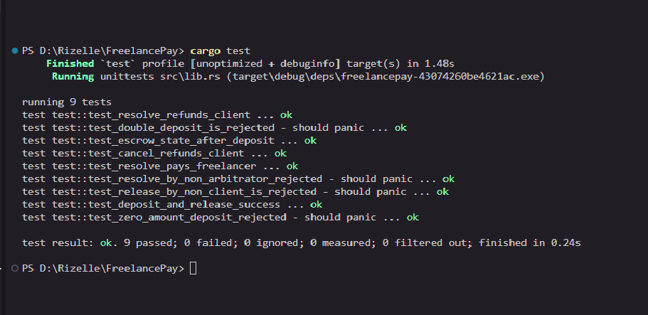
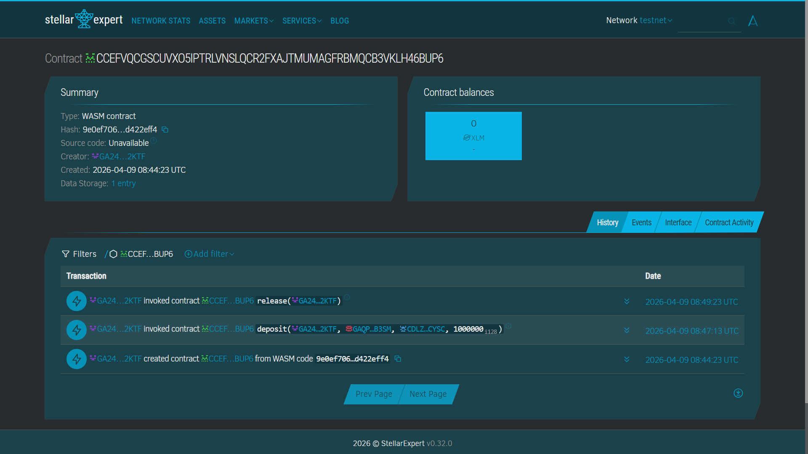

# FreelancePay — Trustless Escrow on Stellar

> Lock funds on Stellar. Pay on delivery. No middleman.

Built on **Soroban** smart contracts for the Stellar Bootcamp hackathon.

🌐 **Live Demo:** [https://freelance-pay-delta.vercel.app/](https://freelance-pay-delta.vercel.app/)

---

## The Problem

Freelancers get ghosted after delivering work. Clients lose money to scammers who disappear before delivering. Traditional escrow services charge high fees and require trusting a third party.

## The Solution

FreelancePay is a **trustless escrow** on Stellar's Soroban smart contract platform. Funds are locked on-chain, visible to both parties, and released only when the client approves — or refunded if they cancel. No banks, no intermediaries, no trust required.

---

## Architecture

```
Client                  FreelancePay Contract          Freelancer
  │                            │                           │
  │──deposit(amount)──────────>│ lock tokens on-chain      │
  │                            │                           │
  │   (work is delivered)      │                           │
  │                            │                           │
  │──release()────────────────>│──transfer(amount)────────>│
  │                            │                           │
  │   OR (work not delivered)  │                           │
  │                            │                           │
  │──cancel()─────────────────>│──refund(amount)──────────>│(back to client)
  │                            │                           │
  └───────────────────get_escrow() → on-chain state────────┘
```

**Storage:** `instance` storage — single active escrow per contract deployment.  
**Token:** Any Stellar Asset Contract (SAC); defaults to native XLM.  
**Events:** `deposit` / `release` / `cancel` events emitted for full transparency.

---

## Contract Functions

| Function | Who can call | What it does |
|---|---|---|
| `deposit(client, freelancer, token, amount)` | Anyone (becomes client) | Locks tokens in contract |
| `release(caller)` | Client only | Pays freelancer, clears escrow |
| `cancel(caller)` | Client only | Refunds client, clears escrow |
| `get_escrow()` | Anyone | Returns current escrow state |

---

## Demo Flow (2 minutes)

1. Open `frontend/index.html` in browser
2. Click **Connect Freighter Wallet** (switch Freighter to Testnet first)
3. Fill in Freelancer Address and Amount, click **Lock Funds in Escrow**
4. Click **Refresh** — see the escrow state appear on-chain
5. Click **Release to Freelancer** → funds transfer instantly
6. Click the Stellar Expert link to see the transaction

---

## Run Tests

```bash
cargo test
```

Expected output: **6 passed, 0 failed**

Tests cover:
- Happy path deposit → release with balance verification
- Unauthorized release rejection
- Cancel with full refund verification
- Double-deposit prevention
- Zero-amount rejection
- Full escrow state verification

---

## Deploy to Stellar Testnet

### Prerequisites

```bash
# Install Stellar CLI
cargo install --locked stellar-cli --features opt

# Add wasm32 target
rustup target add wasm32-unknown-unknown
```

### 1. Build

```bash
cargo build --target wasm32-unknown-unknown --release
```

Output: `target/wasm32-unknown-unknown/release/freelancepay.wasm`

### 2. Configure Network & Identity

```bash
stellar network add testnet \
  --rpc-url https://soroban-testnet.stellar.org \
  --network-passphrase "Test SDF Network ; September 2015"

stellar keys generate --global deployer --network testnet
stellar keys fund deployer --network testnet
```

### 3. Deploy

```bash
stellar contract deploy \
  --wasm target/wasm32-unknown-unknown/release/freelancepay.wasm \
  --source deployer \
  --network testnet
```

**Save the Contract ID** (looks like `CXXXXXXXXXXXXXXXXXXXXXXXXXXXXXXXXXXXXXXXXXXXXXXXXXXXXXXX`).

### 4. Invoke via CLI

```bash
# Lock funds
stellar contract invoke \
  --id <CONTRACT_ID> --source deployer --network testnet \
  -- deposit \
  --client  <CLIENT_ADDRESS> \
  --freelancer <FREELANCER_ADDRESS> \
  --token CDLZFC3SYJYDZT7K67VZ75HPJVIEUVNIXF47ZG2FB2RMQQVU2HHGCYSC \
  --amount 10000000

# Release to freelancer
stellar contract invoke \
  --id <CONTRACT_ID> --source deployer --network testnet \
  -- release --caller <CLIENT_ADDRESS>

# Cancel and refund
stellar contract invoke \
  --id <CONTRACT_ID> --source deployer --network testnet \
  -- cancel --caller <CLIENT_ADDRESS>

# Read escrow state
stellar contract invoke \
  --id <CONTRACT_ID> --source deployer --network testnet \
  -- get_escrow
```

> Amount is in **stroops** (1 XLM = 10,000,000 stroops). The example above deposits 1 XLM.

### 5. Update Frontend

In `frontend/index.html`, replace:

```js
const CONTRACT_ID = 'YOUR_CONTRACT_ID_HERE';
```

with your deployed contract ID.

---

## Frontend

Single-file HTML/CSS/JS — no build step needed.

- Dark mode, responsive UI
- Freighter wallet integration (auto-detects testnet)
- Live escrow state display
- Transaction links to Stellar Expert explorer
- Handles deposit, release, cancel, and get_escrow

Open `frontend/index.html` directly in any browser with Freighter installed.

---

## Why Stellar

| Feature | Benefit |
|---|---|
| **Soroban** | Rust-native smart contracts — safe, fast, auditable |
| **5-second finality** | Payments confirm in real time, not minutes |
| **Low fees** | < $0.001 per transaction vs. high gas fees on EVM chains |
| **Native assets** | XLM and any Stellar asset usable without wrapping |
| **Stellar Expert** | Instant on-chain transparency for all parties |

---

## Submission Checklist

- [x] `cargo test` passes (9/9 tests)
- [x] WASM built: `target/wasm32-unknown-unknown/release/freelancepay.wasm`
- [x] Contract deployed to Stellar Testnet
- [x] GitHub repo pushed: `https://github.com/rzlbautista/FreelancePay`
- [x] Stellar Expert link: `https://stellar.expert/explorer/testnet/contract/CCEFVQCGSCUVXO5IPTRLVNSLQCR2FXAJTMUMAGFRBMQCB3VKLH46BUP6`

## Contract ID

```
CCEFVQCGSCUVXO5IPTRLVNSLQCR2FXAJTMUMAGFRBMQCB3VKLH46BUP6
```

**Stellar Expert:** https://stellar.expert/explorer/testnet/contract/CCEFVQCGSCUVXO5IPTRLVNSLQCR2FXAJTMUMAGFRBMQCB3VKLH46BUP6

---

## Screenshots

### cargo test — 9/9 Passing


### Deployed Contract on Stellar Expert


---

## Tech Stack

- **Smart Contract:** Rust + Soroban SDK 22.0
- **Network:** Stellar Testnet
- **Frontend:** Vanilla HTML/CSS/JS + `@stellar/stellar-sdk` + `@stellar/freighter-api`
- **Wallet:** Freighter
